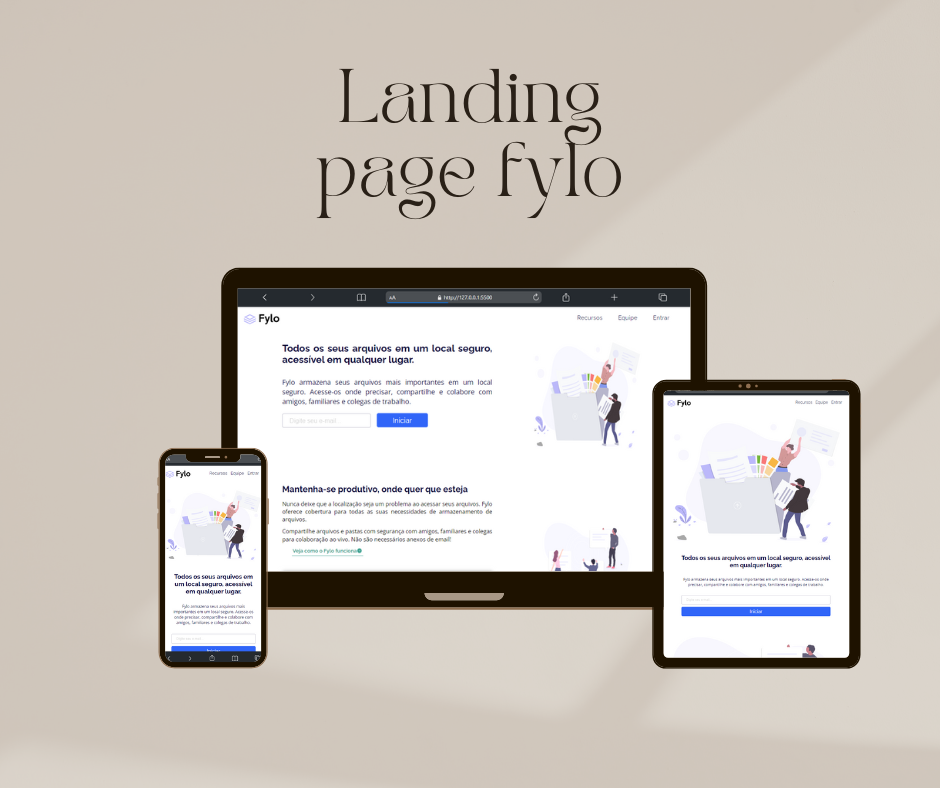

 # Frontend Mentor - Landing page fylo

 ## :house: Sobre o projeto

 

   Este desafio foi proposto pelo site <a href="https://www.frontendmentor.io/home">Frontend Mentor</a>, conhecido por oferecer oportunidades de prática em desenvolvimento front-end, permitindo que os desenvolvedores construam sites em um ambiente de trabalho realista. Essa iniciativa foi realizada com o objetivo principal de aprimorar minhas habilidades. O foco deste desafio era criar uma landing page para uma empresa fictícia denominada Fylo.
 

 ## :pushpin: Projeto
 
 <a href="https://hugo-leite.github.io/landing-page-fylo/">Link do projeto</a>
  
  

 ## :file_folder: Processo
 ### :computer: Tecnologias usadas
   &nbsp;
   &nbsp;
 
 ### :wrench: Construído com

  - Marcação HTML5 Semântica
  - Flexbox
  - Fluxo de trabalho Mobile-first
